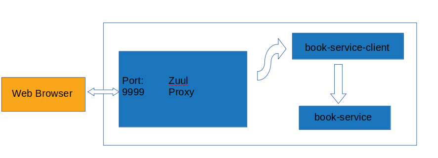

# ABOUT THIS REPOSITORY

Simple Spring (Netflix) Cloud Native Microservice Project.

## Architecture

## Requirements

- Maven 3
- Docker
- Java 8
- docker-compose

## Run

Only run from command line:

> ./build_and_run.sh

## URL Endpoints

- Direct url to book-service <http://localhost:8081/mybooks-public>

- Url to service over zuul proxy <http://localhost:9999/book-service-client/mybooks-public>

  user credentials

  - username: user
  - password: pass

- Discovery Server

  <http://localhost:8761/>

- Zipkin

  <http://localhost:9411>
